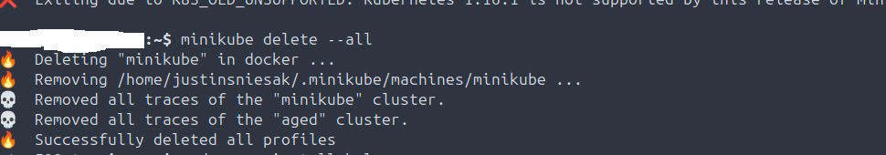

# Helm
Helm functionality, configuration and maintenance.

## Scope
This project covers a series of operational Helm tasks. Each step includes screenshots, the commands used, and an explanation of the task's purpose. The focus areas include charts.

## Environment
- Kubernetes: v1.32.5
- Helm: v3.17.3
- Helm CLI
- kubectl for CLI management and troubleshooting
- Operating System: Ubuntu 24.04.2 LTS (Noble Numbat)
- YAML manifests both authored manually or provided and manipulated/updated during troubleshooting

## Tasks

### Install and start Minikube, confirming no errors, in Ubuntu.

### Install Helm and confirm ENVVAR.

### Shutdown and delete the cluster.

